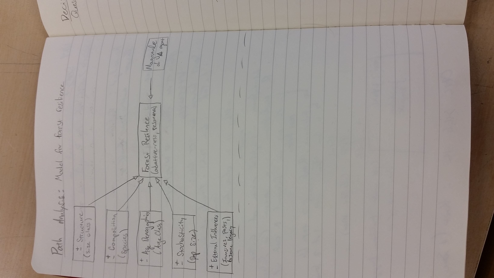
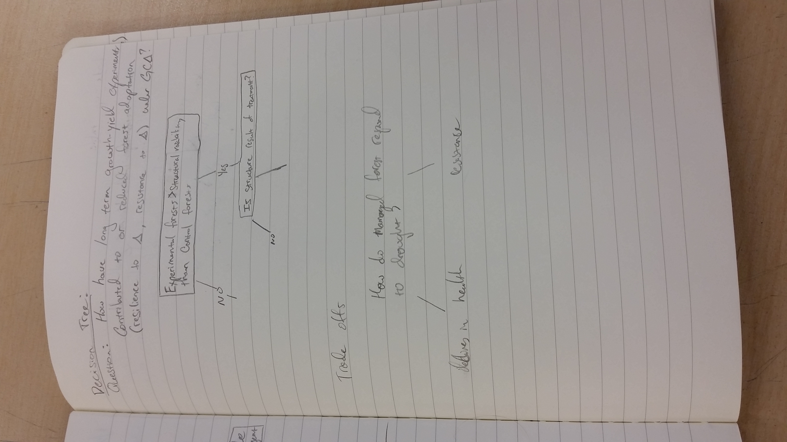
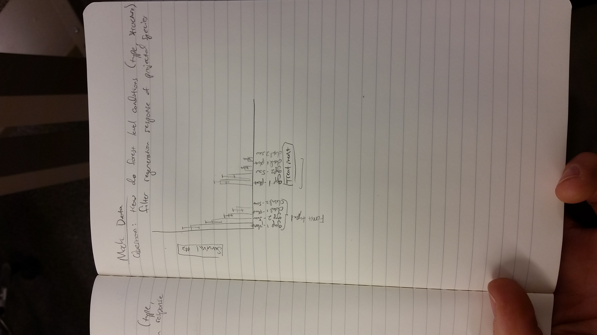

*Path analysis* is the first tool that I used to structure my hypothesis. It is a broad look at the idea of **forest resilience**. I used this tool to explore the predictor variables driving things like forest health, ecological elasticity or changes. This isn't a hypothesis of mine but is a central concept to my research that I am working through

A *decision tree* was used to explore the queston of structural and compositional enhancements of forests through long term manipulations. Variabilityin structure, composition, age classes, etc are important factors to forest ecological resilience (see above). A decision tree is use to explore logic based on binary (or categorical) responses. 

*Lookup Table* needs some work...

I used *Mock Data* to explore my expected results for one test that I will be doing to explore how forest level conditions (forest type, structure, etc) filter regeneration response of projected species.

