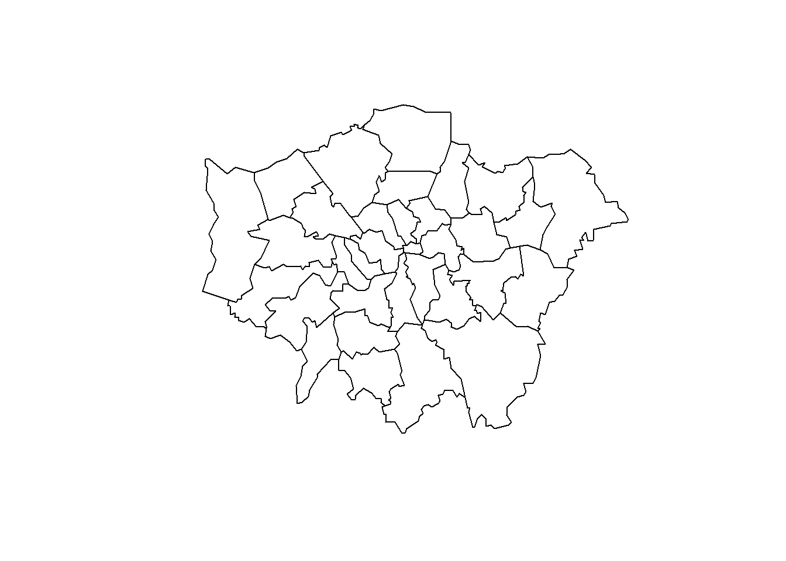
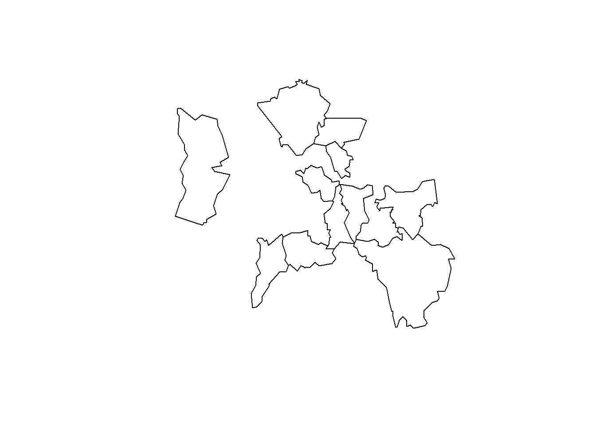
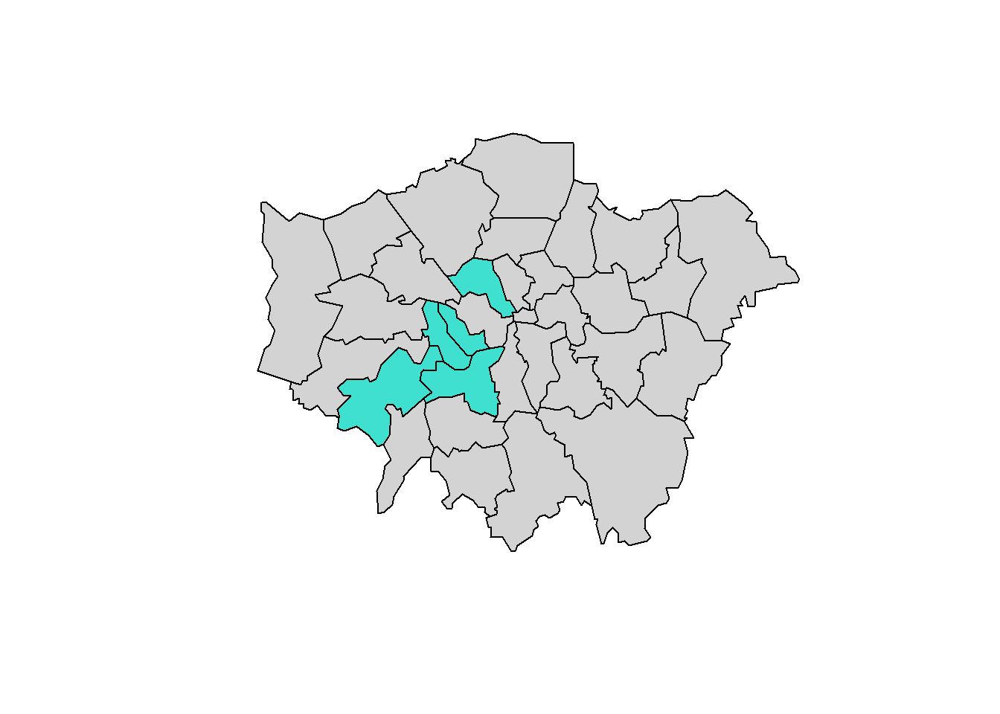
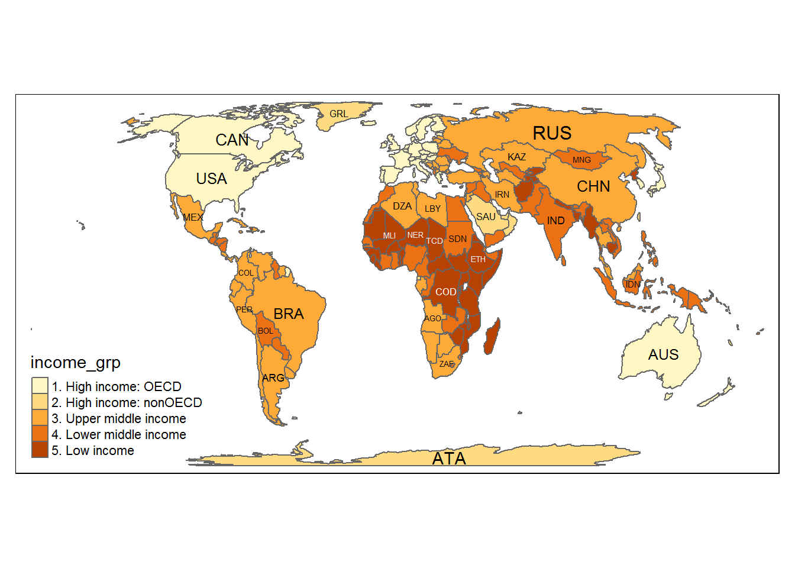
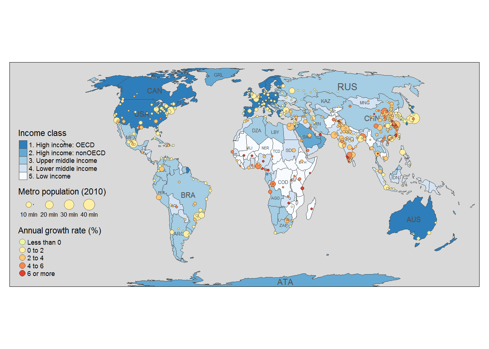

Modified from:

* https://cran.r-project.org/doc/contrib/intro-spatial-rl.pdf

* https://github.com/mtennekes/tmap/tree/master/demo/BubbleMap)


###INSTALL PACKAGES and SET WORKING DIRECTORY


```r
rm(list=ls())

x <- c("rgdal","tmap")
#install.packages(x)
lapply(x, library, character.only = TRUE)
```

###STRUCTURE OF SPATIAL DATA IN R

Spatial objects such as lnd are made up of different 'slots', key slots being '@data' (non geographic attribute data) and @polygons (or @lines for line data) (polygons that make up the physicial boundaries). Specific slots are accessed using the '@' symbol. Using the '$' symbol to see attribute in the @ data slot. 


```r
#Read in the data:

lnd <- readOGR("data", "london_sport") # Read in the data

head(lnd@data) # use the @ symbol to refer to the data slot of the lnd object

mean(lnd$Partic_Per) # use the $ symbol to refer to an attribute in the 'data' slot

sapply(lnd@data, class) # To check the classes of all the variabes in a spatial dataset, you can use this command

lnd$Pop_2001 <- as.numeric(as.character(lnd$Pop_2001)) # Unexpectedly, Pop_2001 is a factor, coerce the variable into the correct, numeric format...

# type "lnd@" and then tab to see which slots are in lnd...

#check number of rows and columns...
nrow(lnd)
ncol(lnd)
```

###BASIC PLOTTING


```r
plot(lnd)
```



###DATA QUERYING AND PLOTTING

```r
# select rows of lnd@data where sports participation is less than 15
lnd@data[lnd$Partic_Per < 15, ] # This is interrogating the attribute data slot only of the lnd object..
```

```
##    ons_label           name Partic_Per Pop_2001
## 17      00AQ         Harrow       14.8   206822
## 21      00BB         Newham       13.1   243884
## 32      00AA City of London        9.1     7181
```

```r
#Using the same logic to subset and plot spatial objects (polygon slot)

# Select zones where sports participation is between 20 and 25%
sel <- lnd$Partic_Per > 20 & lnd$Partic_Per < 25
head(sel) # test output of previous selection
```

```
## [1]  TRUE FALSE  TRUE FALSE  TRUE FALSE
```

```r
plot(lnd[sel, ]) # plotting all TRUE Cases
```



```r
# To see these areas in context with other areas of the maps... use add= TRUE..

plot(lnd, col = "lightgrey") # plot the london_sport object
sel <- lnd$Partic_Per > 25
plot(lnd[ sel, ], col = "turquoise", add = TRUE) # add selected zones to map
```



```r
#Areas of high sports participation are now highlighted in blue!
```

###USING tmap()
Thematic maps are geographical maps in which spatial data distributions are visualized. This package offers a flexible, layer-based, and easy to use approach to create thematic maps, such as choropleths and bubble maps.


```r
library(tmap) # load tmap package

tmap_mode="plot"

# Check out it's capabilities!
#vignette("tmap-nutshell")
```

###Quick Thematic Maps (qtm):

```r
# load spatial data included in the tmap package
data("World", "metro")

# Try typing head(World$...) or head(metro@...) to see the type of data...
head(World@data)
```

```
##    iso_a3                 name           sovereignt     continent
## 2     AFG          Afghanistan          Afghanistan          Asia
## 3     AGO               Angola               Angola        Africa
## 5     ALB              Albania              Albania        Europe
## 8     ARE United Arab Emirates United Arab Emirates          Asia
## 9     ARG            Argentina            Argentina South America
## 10    ARM              Armenia              Armenia          Asia
##          subregion    area  pop_est pop_est_dens gdp_md_est gdp_cap_est
## 2    Southern Asia  652860 28400000     43.50090      22270    784.1549
## 3    Middle Africa 1246700 12799293     10.26654     110300   8617.6635
## 5  Southern Europe   27400  3639453    132.82675      21810   5992.6588
## 8     Western Asia   83600  4798491     57.39822     184300  38407.9078
## 9    South America 2736690 40913584     14.95003     573900  14027.1261
## 10    Western Asia   28470  2967004    104.21510      18770   6326.2469
##                      economy              income_grp life_exp well_being
## 2  7. Least developed region           5. Low income     48.7   4.758381
## 3  7. Least developed region  3. Upper middle income     51.1   4.206092
## 5       6. Developing region  4. Lower middle income     76.9   5.268937
## 8       6. Developing region 2. High income: nonOECD     76.5   7.196803
## 9    5. Emerging region: G20  3. Upper middle income     75.9   6.441067
## 10      6. Developing region  4. Lower middle income     74.2   4.367811
##         HPI
## 2  36.75366
## 3  33.20143
## 5  54.05118
## 8  31.77827
## 9  54.05504
## 10 46.00319
```

```r
head(metro@data)
```

```
##            name             name_long iso_a3 pop1950 pop1960 pop1970
## 2         Kabul                 Kabul    AFG  170784  285352  471891
## 8       Algiers El Djazair  (Algiers)    DZA  516450  871636 1281127
## 13       Luanda                Luanda    AGO  138413  219427  459225
## 16 Buenos Aires          Buenos Aires    ARG 5097612 6597634 8104621
## 17      Cordoba               Cordoba    ARG  429249  605309  809794
## 25      Rosario               Rosario    ARG  554483  671349  816230
##    pop1980  pop1990  pop2000  pop2010  pop2020  pop2030
## 2   977824  1549320  2401109  3722320  5721697  8279607
## 8  1621442  1797068  2140577  2432023  2835218  3404575
## 13  771349  1390240  2591388  4508434  6836849 10428756
## 16 9422362 10513284 12406780 14245871 15894307 16956491
## 17 1009521  1200168  1347561  1459268  1562509  1718192
## 25  953491  1083819  1152387  1298073  1453814  1606993
```

```r
#  quick plot example: 
qtm(World, fill = "income_grp", text = "iso_a3", text.size = "AREA") # use "World$" to see the two attributes: income_grp and iso_a3, text.size= area: text is sized increasingly with coutry area size.
```



###MORE COMPLEX MAPPING

For More Complex Maps use the main plotting method for readability

```r
# calculate annual growth rate
metro$growth <- (metro$pop2020 - metro$pop2010) / (metro$pop2010 * 10) * 100

# plot
tm_shape(World) +
	tm_polygons("income_grp", palette = "-Blues", 
		title = "Income class", contrast = 0.7, border.col = "grey30", id = "name") +

	tm_text("iso_a3", size = "AREA", col = "grey30", root=3) +

  tm_shape(metro) +
  tm_bubbles("pop2010", col = "growth", border.col = "black",
		border.alpha = 0.5,
		breaks = c(-Inf, 0, 2, 4, 6, Inf) ,
		palette = "-RdYlGn",
		title.size = "Metro population (2010)", 
		title.col = "Annual growth rate (%)",
		id = "name",
		popup.vars=c("pop2010", "pop2020", "growth")) + 
tm_format_World() + 
tm_style_gray()
```



###INTERACTIVE VIEW MODE
Interactive viewing with tmap

```r
tmap_mode("view") # sets the tmap mode to interactive viewing
```

```
## tmap mode set to interactive viewing
```

```r
last_map() # returns the last map to be modified or created
```

```
## Warning: Text labels not supported in view mode.
```

preservef7eeebeabe44a418
